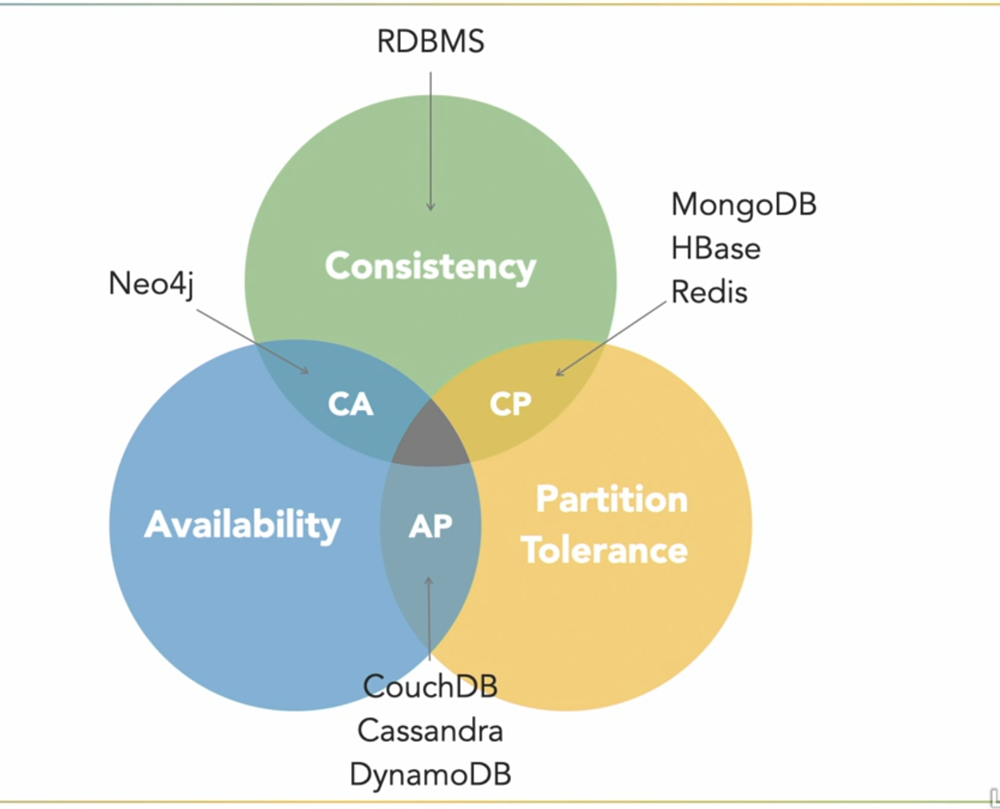
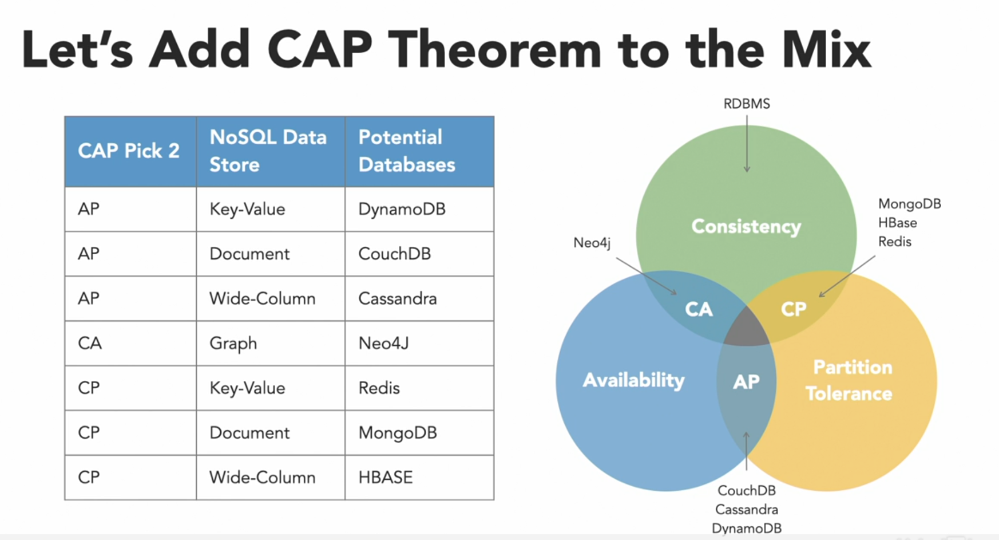

# Database

## Relational DBMS

- Oracle Database (Oracle Corporation)
- Microsoft SQL Server (Microsoft)
- Db2 (IBM)
- MariaDB (open source)
- PostgreSQL (open source)
- SQLite (open source)

## NoSQL DBMS

- MongoDB
- redis
- Neo4j
- Couch DB
- Cassandra
- Couchbase
- HBase
- DynamoDB
- OrientDB
- Cloudant

## The service object will allow us to make all CRUD transactions for one table. CRUD stands for

- Create
    > MYSQL Query: INSERT INTO `users` (`name`, `email`, `password`, `updated_at`, `created_at`) VALUES ('test', '<test@gmail.com>', 'test', '2019-01-01 00:00:00', '2019-01-01 00:00:00');

- Read
    > MYSQL Query: SELECT * FROM `users`

- Update
    > MYSQL Query: UPDATE `users` FROM SET `name` = `test` WHERE `id` = `1`;

- Delete
    > MYSQL Query: DELETE FROM `users` WHERE `id` = `1`;

- CRUD is a term that is used quite commonly with software development. The 4 aspects of CRUD are synonymous with PostgreSQL terms for:
  - INSERT
  - SELECT
  - UPDATE
  - DELETE
- Or synonymous in HTTP methods to:
  - POST
  - GET
  - PATCH or PUT
  - DELETE

## ACID

- Atomicity
  > Atomicity requires that each transaction be "all or nothing": if one part of the transaction fails, the entire transaction fails, and the database state is left unchanged. An atomic system must guarantee atomicity in each and every situation, including power failures, errors, and crashes. To the outside world, a committed transaction appears (by its effects on the database) to be indivisible ("atomic"), and an aborted transaction does not happen.

- Consistency
  > The consistency property ensures that any transaction will bring the database from one valid state to another. Any data written to the database must be valid according to all defined rules, including constraints, cascades, triggers, and any combination thereof. This does not guarantee correctness of the transaction in all ways the application programmer might have wanted (that is the responsibility of application-level code) but merely that any programming errors cannot result in the violation of any defined rules.

- Isolation
  > The isolation property ensures that the concurrent execution of transactions results in a system state that would be obtained if transactions were executed serially, i.e., one after the other. Providing isolation is the main goal of concurrency control. Depending on concurrency control method (i.e., if it uses strict - as opposed to relaxed - serializability), the effects of an incomplete transaction might not even be visible to another transaction.

- Durability
  > Durability means that once a transaction has been committed, it will remain so, even in the event of power loss, crashes, or errors. In a relational database, for instance, once a group of SQL statements execute, the results need to be stored permanently (even if the database crashes immediately thereafter). To defend against power loss, transactions (or their effects) must be recorded in a non-volatile memory.

## MYSQL

- It is not case sensitive
  > SELECT *FROM `products` WHERE `category` = 'shoes'; **==** SELECT* FROM `products` WHERE `category` = 'ShoeS';

- Ifnull statements
  > SELECT `name`, `price`, IFNULL(`description`, 'No description available') FROM `products`;  

- Case
  > SELECT `name`, `price`, CASE WHEN `description` IS NULL THEN 'No description available' ELSE `description` END as `description` FROM `products`;

## MongoDB

## Database Content

- What does a database represent
  > A database represents a collection of data organized in a way that makes it easy to access, manage, and update.

  > A database is a collection of data that is stored in a computer system. Databases allow their users to enter, access, and analyze their data quickly and easily. They are used in a variety of different settings, from retail to online publishing.

  > A organized data storage mode that is easy to access, manage and update.

### Database Conceptual Schema
  >
  > A conceptual schema or conceptual data model is a map of concepts and their relationships. This describes the semantics of an organization and represents a series of assertions about its nature. Specifically, it describes the things of significance to an organization (entity classes), about which it is inclined to collect information, and characteristics of (entity class associations) and constraints on these things of significance (entity class attributes). A conceptual schema is often used to communicate the ideas of a designer to the users of the intended system, and is often created after one or more conceptual models of process flows have been drawn. Conceptual schemas are often confused with concept maps, mind maps, and various other diagrams. The ER model is the most common conceptual schema.
  > Stores and provides access to data from tables that are related to each other.

### Integrity Restrictions

- The stage of create a database
  - Analysis, defining the objectives
  
  - Structural: objects, associaltions, attributes, keys
  - Dyanmic: data types
  - functional: data sources, uses for the data

#### Design, defining the schema

- Choice of the DBMS
- The Actual Design

#### Implementation, creating the database and loading the data

- Development of the database application
- Populating the database
- Testing the database application
- Documentation

- Operation, using the database
- Maintenance, modifying the database structure
- Administration, managing the database + data access
- Replication, copying the database to other locations
- Reporting, generating reports from the data

> Restriction Types

- NULL (Non-existent Value)
- NOT NULL (Must have a value)
- UNIQUE (Must be unique)
- PRIMARY KEY (Must be unique and not null)
  - A primary key is a special relational database table column (or combination of columns) designated to uniquely identify all table records.

- FOREIGN KEY (Must be a value that exists in another table)
  - A foreign key is a column or group of columns in a relational database table that provides a link between data in two tables. It acts as a cross-reference between tables because it references the primary key of another table, thereby establishing a link between them.

- CHECK (Must satisfy a condition)
- DEFAULT (Default value if no value is specified)
- INDEX (Index for faster retrieval)

#### The Design of a Database

> 1st NF (First Normal Form)

- Each column must be atomic (not multivalued)
- Each row must be unique (no duplicate rows)
- The order of the columns and rows is immaterial

> 2nd NF (Second Normal Form)

- It must be in 1st NF
- There must be no partial dependencies (no calculated columns)
- There must be a primary key
- All non-key columns must depend on the primary key
- The order of the columns and rows is immaterial

> 3rd NF (Third Normal Form)

- It must be in 2nd NF
- There must be no transitive dependencies (no calculated columns)
- All non-key elements are mutually independent

#### Links

- 1-1 (orders-receipts)
- 1-n (orders-order items)
- n-n (products-orders)

#### Data Types

- Numeric
  - Integer
  - Float
  - Decimal
  - Boolean
- Character
  - Char (size) - Fixed length
  - Varchar (size) - Variable length
  - Text
- Date and Time
- Binary
- Other
  - Enum
  - Set
  - JSON
  
#### SQL Commands

- DDL
  - CREATE (Create a new object {table,constraint,index,view,trigger,procedure,etc})
  - ALTER (Alter the properties of an object)
  - DROP (Delete an object)
  - TRUNCATE (Delete all rows from a table)

- DML
  - INSERT (Insert a new row)
  - UPDATE (Update an existing row)
  - DELETE (Delete an existing row)

- DQL
  - SELECT (Select rows from a table)
  - FROM (Select rows from a table)
  - WHERE (Select rows from a table)
  - GROUP BY (Group rows from a table)
  - HAVING (Group rows from a table)
  - ORDER BY (Order rows from a table)
  - LIMIT (Limit the number of rows from a table)
  - OFFSET (Limit the number of rows from a table)
  - JOIN (Join rows from a table)
  - UNION (Join rows from a table)
  - INTERSECT (Join rows from a table)
  - EXCEPT (Join rows from a table)
  - MIN (Aggregate function)
  - MAX (Aggregate function)
  - AVG (Aggregate function)
  - SUM (Aggregate function)
  - COUNT (Aggregate function)
  - DISTINCT (Aggregate function)
  - AS (Alias)
  - IS NULL (Null check)
  - IS NOT NULL (Null check)
  - IN (List check)
  - NOT IN (List check)
  - BETWEEN (Range check)
  - NOT BETWEEN (Range check)
  - LIKE (Pattern check)
  - NOT LIKE (Pattern check)
  - ANY (List check)
  - ALL (List check)
  - EXISTS (Existence check)
  - NOT EXISTS (Existence check)
  - CASE (Conditional)
  - CAST (Type conversion)
  - COALESCE (Null check)
  - NULLIF (Null check)

- TPL
  - COMMIT (Commit a transaction)
  - ROLLBACK (Rollback a transaction)

- DCL
  - GRANT (Grant privileges)
  - REVOKE (Revoke privileges)
  
#### Syntax

- SELECT Query
  > SELECT [DISTINCT] (Column1[alias],Column2[alias2])
  > FROM table_name
  > WHERE condition
  > GROUP BY columns
  > HAVING condition
  > ORDER BY columns [ASC|DESC]
  > LIMIT count [OFFSET offset]

  - For Example
    > SELECT `department`, SUM(`salary`),`total_wages`
    > FROM `employees`
    > WHERE `department` IN ('sales','marketing')
    > GROUP BY `department`
    > HAVING SUM(`salary`) > 100000;
    > ORDER BY SUM(`salary`) DESC
    > LIMIT 10 OFFSET 5;

  - SUB Query
    > SELECT `name`, `salary`
    > FROM `employees`
    > WHERE `salary` > (SELECT AVG(`salary`) FROM `employees`);

- JOIN Query
  > SELECT table1.column1, table2.column2...
  > FROM table1
  > INNER JOIN table2 ON table1.common_field = table2.common_field;

- UNION Query
  > SELECT column1, column2, column3 FROM table1
  > UNION
  > SELECT column1, column2, column3 FROM table2;

- INSERT Query
  > INSERT INTO table_name (Column1,Column2)
  > VALUES (value1,value2)

- UPDATE Query
  > UPDATE table_name
  > SET Column1 = value1, Column2 = value2
  > WHERE condition

- DELETE Query
  > DELETE FROM table_name
  > WHERE condition

#### SQL Function

- Aggregate Functions
  - AVG()
  - COUNT()
  - FIRST()
  - LAST()
  - MAX()
  - MIN()
  - SUM()

- Scalar Functions
  - UCASE()
  - LCASE()
  - MID()
  - LEN()
  - ROUND()
  - NOW()
- String Functions
  - CONCAT()
  - SUBSTRING()
  - REPLACE()
  - REVERSE()
  - CHAR_LENGTH()
  - FIND_IN_SET()
  - FORMAT()
  - INSERT()
  - INSTR()
  - LCASE()
  - LEFT()
  - LENGTH()
  - LOCATE()
  - LOWER()
  - LPAD()
  - LTRIM()
  - REPEAT()
  - REPLACE()
  - REVERSE()
  - RIGHT()
  - RPAD()
  - RTRIM()
  - SPACE()
  - STRCMP()
  - SUBSTR()
  - SUBSTRING()
  - SUBSTRING_INDEX()
  - TRIM()
  - UCASE()
  - UPPER()
  - ASCII()
  - BIN()
  - BIT_LENGTH()
  - CHAR()
  - CHAR_LENGTH()
  - CHARACTER_LENGTH()
  - CONCAT()
  - CONCAT_WS()
  - ELT()
  - EXPORT_SET()
  - FIELD()
  - FIND_IN_SET()
  - FORMAT()
  - FROM_BASE64()
  - HEX()
  - INSERT()
  - INSTR()
  - LCASE()
  - LEFT()
  - LENGTH()
  - LOAD_FILE()
  - LOCATE()
  - LOWER()
  - LPAD()
  - LTRIM()
  - MAKE_SET()
  - MID()
  - OCT()
  - OCTET_LENGTH()
  - ORD()
  - POSITION()
  - QUOTE()
  - REPEAT()
  - REPLACE()
  - REVERSE()
  - RIGHT()
  - RPAD()
  - RTRIM()
  - SOUNDEX()
  - SPACE()
  - STRCMP()
  - SUBSTR()
  - SUBSTRING()
  - SUBSTRING_INDEX()
  - TRIM()
  - UCASE()
  - UNHEX()
  - UPPER()
  - WEIGHT_STRING()
  - BIT_LENGTH()
  - CHAR_LENGTH()
  - CHARACTER_LENGTH()
- Date Functions
  - ADDDATE()
  - ADDTIME()
  - CONVERT_TZ()
  - CURDATE()
  - CURRENT_DATE()
  - CURRENT_TIME()
  - CURRENT_TIMESTAMP()
  - CURTIME()
  - DATE()
  - DATE_ADD()
  - DATE_FORMAT()
  - DATE_SUB()
  - DATEDIFF()
  - DAY()
  - DAYNAME()
  -
- Numeric Functions
- System Functions
- User Defined Functions
- Null Functions
- Conversion Functions
- Advanced Functions
- Analytic Functions
- Miscellaneous Functions
- Window Functions
- JSON Functions
- Encryption Functions
- Compression Functions
- Spatial Functions
- Information Functions
- Regular Expression Functions
- XPath Functions
- XQuery Functions
- SQL/XML Functions
- SQL/JSON Functions
- SQL/ROWID Functions
- SQL/JSON Path Functions
- SQL/JSON Query Functions
- SQL/JSON Utility Functions
- SQL/JSON Generation Functions
- SQL/JSON Object Functions
- SQL/JSON Array Functions

#### Triggers

- A trigger is a special type of stored procedure that automatically runs when an event occurs in the database server. DML triggers run when a user tries to modify data through a data manipulation language (DML) event. DML events are INSERT, UPDATE, or DELETE statements on a table or view. These triggers fire when any valid event is fired, regardless of whether or not any table rows are affected.
- Syntax
  - CREATE [OR REPLACE] TRIGGER trigger_name
  - {BEFORE | AFTER | INSTEAD OF} {INSERT [OR] | UPDATE [OR] | DELETE}
  - [OF col_name]
  - ON table_name
  - [REFERENCING OLD AS o NEW AS n]
  - [FOR EACH ROW]
  - WHEN (condition)
  - BEGIN
  - -- SQL statements
  - END;

#### Indexes

- An index is a data structure that improves the speed of data retrieval operations on a database table at the cost of additional writes and storage space to maintain the index data structure. Indexes are used to quickly locate data without having to search every row in a database table every time a database table is accessed. Indexes can be created using one or more columns of a database table, providing the basis for both rapid random lookups and efficient access of ordered records.
- Syntax
  - CREATE INDEX index_name
  - ON table_name (column1, column2, ...);
  - CREATE UNIQUE INDEX index_name
  - ON table_name (column1, column2, ...);
  - DROP INDEX table_name.index_name;
  - SHOW INDEX FROM table_name;

#### Sequences

- A sequence is a database object that generates a sequence of numbers. This sequence of numbers is generated in an ascending or descending order at a defined interval and can be configured to restart (cycle) when exhausted. Sequences are commonly used to generate unique numeric identifiers for rows of a database table. Sequences can be extremely useful in assigning non-random, unique identification numbers to tables that require such values. Sequences are similar to the AUTO_INCREMENT property supported by some databases, such as MySQL and SQL Server, but offer more flexibility and functionality.
- Syntax
  - CREATE SEQUENCE sequence_name
  - START WITH 1
  - INCREMENT BY 1
  - MINVALUE 1
  - NO MAXVALUE
  - CACHE 10;
  - DROP SEQUENCE sequence_name;
  - ALTER SEQUENCE sequence_name
  - INCREMENT BY 5
  - NO MINVALUE
  - NO MAXVALUE;
  - SELECT sequence_name.NEXTVAL
  - FROM dual;
  - SELECT sequence_name.CURRVAL
  - FROM dual;
  - SELECT sequence_name.NEXTVAL
  - FROM dual;

#### Views

- A view is a virtual table based on the result-set of an SQL statement. A view contains rows and columns, just like a real table. The fields in a view are fields from one or more real tables in the database. You can add SQL functions, WHERE, and JOIN statements to a view and present the data as if the data were coming from one single table.
- Syntax
  - CREATE VIEW view_name AS
  - SELECT column1, column2, ...
  - FROM table_name
  - WHERE condition;
  - DROP VIEW view_name;
  - SELECT * FROM view_name;
  - CREATE OR REPLACE VIEW view_name AS
  - SELECT column1, column2, ...
  - FROM table_name
  - WHERE condition;
  - ALTER VIEW view_name AS
  - SELECT column1, column2, ...
  - FROM table_name
  - WHERE condition;

#### CAP Theorem

