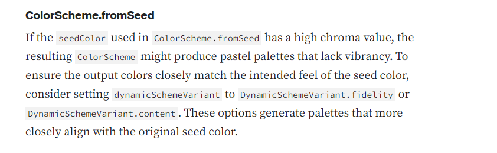
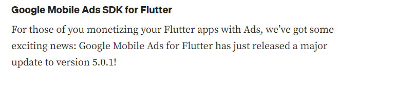
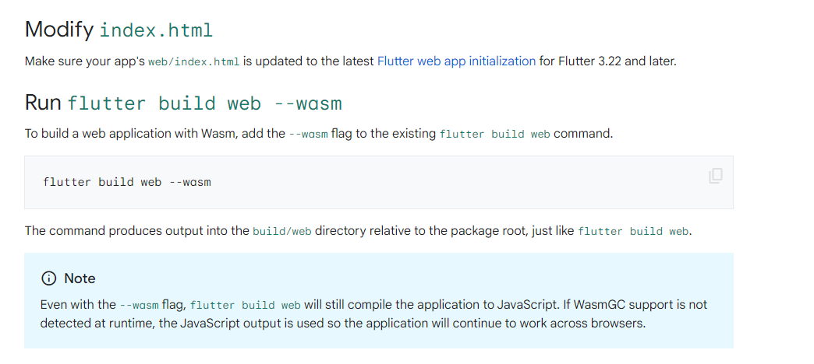
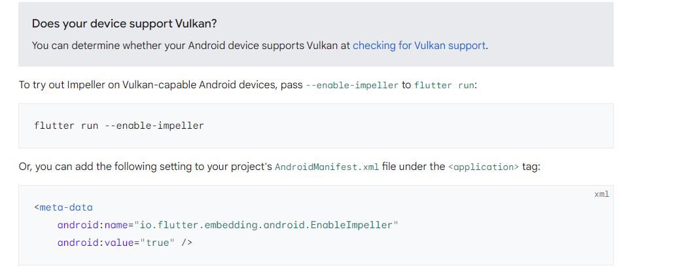
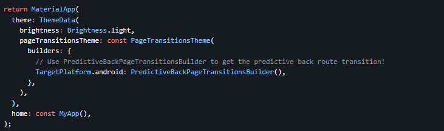
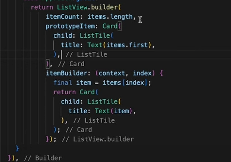

# flutter

- [Changing the entry point of flutter](flutter run .\lib\my_other_main.dart)

## Create .dmg

> In MacOS
> Run `Flutter build macos`
> Require Nodejs in mac
> We will use `node-appdmg` package

```Bash
npm i -g appdmg
appdmg --version
or
npx appdmg --version
#  create a new file config.json
#  add the following content
```

```JSON
{
  "title": "Flutter",
  "background": "background.png",
  "icon": "icon.icns",
  "contents": [
    {
      "x": 441,
      "y": 344,
      "type": "link",
      "path": "/Applications"
    },
    {
      "x": 441,
      "y": 434,
      "type": "file",
      "path": "Flutter.app"
    }
  ]
}
```

```Bash
appdmg config.json Flutter.dmg
```
 

## Packages

- Nice_intro
- Animations
- Modern Text Theming
- Fast Start
- New networking tool
- Accessibility & Internationalization
- New Dev Plugins
- Hot Reload is more resilient

## Responsiveness

```Dart
const   _kListItemExtent = 50.0;
const   _kMaxTimeWidth = 150.0;
const   _kGridViewBreakPoint = 550.0;

class AdaptiveContainer extends StatelessWidget{
    const AdaptiveContainer({Key key, this.names}):super(key:key);
    final list<String> names;

    @override
    widget build(BuildContext context){
        if(MediaQuery.of(context).size.width<_kGridViewBreakPoint){
            return ListView(
                itemExtent: _kListItemExtent,
                children: names.map<Widget>({string name} => AdaptedListItem(name:name)).toList(),
            );

        }else{
            return GridView.extent(
                maxCrossAxisExtent:_kMaxTimeWidth,
                children: names.map<Widget>({string name} => AdaptedListItem(name:name)).toList()
            );
        }
    }
}
```

```Dart
LayoutBuilder(
    builder:(context,constraints){
        if(constraints.maxWidth>600){
            getWidgetLayout();
        }else{
            getNormalLayout();
        }
    };
)
```

```Dart
OrientationBuilder(
    builder:(context,orientation){
        return GridView.count(
            crossAxisCount:orientation==Orientation.portrait?2:3,
        )
    }
)
```

## Responsive Widget

1. AspectRatio
2. CustomSingleChildLayout
4. CustomMultiChildLayout
5. FittedBox
6. FractionallySizedBox
7. LayoutBuilder
8. MediaQuery
9. MediaQueryData
10. OrientationBuilder

## Payments

- Stripe
- Razerpay
- cashfree
- paytm
- paypal

## Android to iOS M1 Chip

> Add Firebase code if firebase is added in app
> run `flutter run` in ios
> go to ios/Podfile > "platform :ios, '10.0'"
> go to iOS folder in terminal now

```bash
sudo arch -x86_64 gem install ffi
arch -x86_64 pod install --repo-update
```

> run using xCode

## Github Actions

```YAML
# name: Deploy to Firebase Hosting on merge
'on':
  push:
    branches:
      - main
jobs:
  build_and_deploy:
    runs-on: ubuntu-latest
    steps:
      - uses: actions/checkout@v2
      - run: npm ci && npm run build
      - uses: FirebaseExtended/action-hosting-deploy@v0
        with:
          repoToken: '${{ secrets.GITHUB_TOKEN }}'
          firebaseServiceAccount: '${{ secrets.FIREBASE_SERVICE_ACCOUNT_EXPERIMENTS_344B6 }}'
          channelId: live
          projectId: experiments-344b6
```

```YAML
# name: Deploy to Firebase Hosting on PR
'on': pull_request
jobs:
  build_and_preview:
    if: '${{ github.event.pull_request.head.repo.full_name == github.repository }}'
    runs-on: ubuntu-latest
    steps:
      - uses: actions/checkout@v2
      - run: npm ci && npm run build
      - uses: FirebaseExtended/action-hosting-deploy@v0
        with:
          repoToken: '${{ secrets.GITHUB_TOKEN }}'
          firebaseServiceAccount: '${{ secrets.FIREBASE_SERVICE_ACCOUNT_EXPERIMENTS_344B6 }}'
          projectId: experiments-344b6
```

## Publish App on Play Store

> if you are using Firebase then for the signing key of play store go to [App signing](https://play.google.com/console/u/0/developers/8974957902583579176/app/4975033712090900466/keymanagement?tab=appSigning) and paste the key in firebase General Project settings
> Get the new Google Services file and add it to your Flutter project

## Subscriptions

[RevenueCat]([https://](https://app.revenuecat.com))


## Docker

### Simple Node serve for static files

<!-- File Structure -->

```
web
    - index.html
    - main.js
    - style.css
Dockerfile
```


```Dockerfile
FROM node:lts-alpine
RUN npm -y -g install serve
WORKDIR /app/
COPY . .

EXPOSE 3000
CMD ["serve", "web"]
```

<!-- Build image using dockerfile -->
- docker build -t my_docker_image -f .\Dockerfile .
<!-- Run the image -->
- docker run -d -p 8080:8080 my_docker_image


Currently, the supported version ranges are as follows:

Gradle — Fully supported 7.0.2 to current, warn otherwise
AGP — Fully supported 7.0.0 to current, warn otherwise
Java — Fully supported Java 11 to current, warn otherwise
Kotlin — Fully supported 1.5.0 to current, warn otherwise
In the next major release these warnings will become errors, which can be overridden with the flag `--android-skip-build-dependency-validation`






 