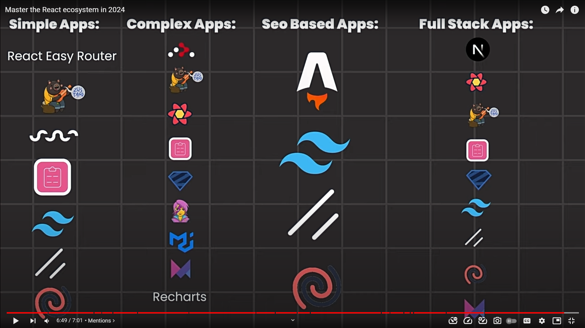

# Javascript

## Var vs Let vs Const

- var : Hoisting mechanism variable declarations are moved to the top of their scope before code execution. So a variable defined somewhere within the function would be created at the top of the function. Also, if the variable is declared outside the function, it attaches itself to the global scope.
- If you compare var vs let, block-level binding is one of the major differences between the two.
- Unlike the var keyword which lets you declare the same variable again within the same scope, the variable declared with let keyword will throw an error. With the let keyword, only a single variable with the same identifier can be created in the existing scope even if the declaration has been done using the var keyword. Let’s have a look at the following piece of code as an example.
- const like let declarations have a block-level scope. This means unlike the variables declared using the var keywords, constants are not hoisted to the top of the scope within which they are declared.
- Now if the same variable is declared in a different scope it will not throw an error but will be available to be used with a different value within the scope it has been declared. Here is an example:

## Spread Operator (...)

- Copy an Array

```javascript
let arr1 = [1, 2, 3];
let arr2 = [...arr1];
console.log(arr2); //[1,2,3]
```

- Create an array from characters in a string

```Javascript
let string = "Hello";
let arr = [...string];
console.log(arr); // ['H','e','l','l','- ']
```

- Adding of array

```Javascript
let arr1 = [1,2,,3];
let arr2 = [4,5];
arr3 = [...arr1,...arr2];
console.log(arr3); //[1,2,3,4,5]
```

- With push

```Javascript
let arr1 = [1,2,3];
let arr2 = [4,5,6];
arr1.push(...arr2);
console.log(arr1);//[1,2,3,4,5,6]
```

- With Un shift

```Javascript
let arr1 = [1,2,3];
let arr2 = [4,5,6];
arr1.push(...arr2);
console.log(arr1);//[4,5,6,1,2,3]
```

- Math operations

```Javascript
let arr = [1,2,3,0.5,-1];
console.log(Math.min(...arr));//-1
console.log(Math.max(...arr));//3
```

- As a argument in arrow functions

```Javascript
const sum = (...args)=> {
    let sum = 0;
    for(let i =0;i<args.length;i++){
        sum+= args[i];
    }
    return sum;
};
console.log(sum(2,3));//5
console.log(sum(2,3,4));//9
console.log(sum(2,3,4,5));//14
```

- Destructuring an object

```Javascript
let {x,y,...z} = {x:1,y:2,a:3,b:4,c:5};
console.log(x);//1
console.log(y);//2
console.log(z);//{a:3,b:4,c:5}
```

## Shorthand

```JavaScript
// Longhand version
switch (something) {
  case 1:
    doSomething();
  break;
case 2:
    doSomethingElse();
  break;
case 3:
    doSomethingElseAndOver();
  break;
  // And so on...
}
// Shorthand version
var cases = {
  1: doSomething,
  2: doSomethingElse,
  3: doSomethingElseAndOver
};


// Longhand version
if (isTrue === true)
if (isTrue === false)
// Shorthand version
if (isTrue)
if (!isTrue)


// Longhand
if(x == 1 || x == 5 || x == 7)  {
  console.log('X has some value');
}
// Shorthand
([1,5,7].indexOf(x) !=- 1) && alert('X has some value!');


// Longhand
let result;
if (x) {
    result = "If Case";
}
else {
    result = "Else Case";
}
// Shorthand
let x = true; let result = x ? "If Case" : "Else Case";


// Longhand
if (hero === 'Robin') {
  callRobin();
}
else if (hero === 'Raven') {
  callRaven();
}
else if (hero === 'Starfire') {
  callStarfire();
}
else if (hero === 'BeastBoy') {
  callBeastBoy();
} else {
  throw new Error('No such hero is available...!!! - ' + type);
}

// Shorthand
var heroNeeded= {
  Robin: callRobin,
  Raven: callRaven,
  Starfire: callStarfire,
  BeastBoy: callBeastBoy
};

var func = heroNeeded[hero];
(!func) && throw new Error('Hero not available ' + hero);
func();


// Longhand version
let justiceLeaque = ['Batman', 'Superman', 'Flash', 'Green Lantern']
for(let hero = 0; hero < justiceLeaque.length; hero++){
   console.log(justiceLeaque[hero])
}
// Shorthand version
let justiceLeaque = ['Batman', 'Superman', 'Flash', 'Green Lantern']
for(let hero of justiceLeaque){
   console.log(hero)


// Longhand
if (anyVariable !== null || anyVariable !== undefined || anyVariable !== '') {
  var doSomeCalculation = anyVariable;
}
// Shorthand
var doSomeCalculation = anyVariable  || '';
//output: '' (an empty string)


function printA () {
  console.log('A');
};
function printB () {
  console.log('B');
};
// Longhand
var isTrue = true;
if (isTrue) {
  printA();
} else {
  printB();
}
// Shorthand
(isTrue ? printA : printB)();


// Longhand
let heroes = ['Raven', 'Starfire', 'BeastBoy']
// concatenate
let titans = ['Robin'].concat(heroes)
//shorthand
let heroes = ['Raven', 'Starfire', 'BeastBoy']
// Concatenation using ... operator.
let titans = ['Robin', ...heroes]


// Longhand version
const heroes = ['Batman', 'Superman', 'Hawk', 'Wonder Woman'];
const justiceLeaque = heroes.slice()
// shorthand version
const heroes = ['Batman', 'Superman', 'Hawk', 'Wonder Woman'];
const justiceLeaque = [...heroes];


// longhand
function print(){
console.log('print A');
}
//shorthand
// In case of single line function
const print = () => {
   console.log('print A');
};
Another Example -
// Longhand version
list.forEach(function(item) {
    console.log(item);
});
// Shorthand version
list.forEach(item => console.log(item));


// Longhand
var justiceLeaque  = new Array();
justiceLeaque[0] = 'Batman';
justiceLeaque[1] = 'Superman';
justiceLeaque[2] = 'Flash';
// Shorthand
var justiceLeaque = ['Batman', 'Superman', 'Flash'];

// Longhand
var teenTitans = new Array();
teenTitans['Dick Grayson'] = 'Robin';
teenTitans['Kory Anders'] = 'Starfire';
teenTitans['Rachel Roth'] = 'Raven';
teenTitans['Gar Logon'] = 'Beast Boy';

// Shorthand
var teenTitans = {
  'Dick Grayson': 'Robin',
  'Kory Anders': 'Starfire',
  'Rachel Roth': 'Raven',
  'Gar Logon': 'Beast Boy'
};


doSomething(111, [], 'Hello', ....);
// Longhand
function doSomething(numberParameter, objectParameter, stringParameter ,....) {
  // do something...
}
// Shorthand
function doSomething() {
  for (i = 0; i < arguments.length; i++) {
    console.log( typeof arguments[i] );
    // Returns number, object, string, .....
  }
}
```

React Libraries



## Express to heroku

1. Hide secrets
   - process.env.API_TOKEN
   - .env -> .gitignore
2. Respect the PORT from the environment
   - const PORT = process.env.PORT || 8000
3. Use minimal logging

   - morgon ('dev'),('common') -> ('short'),('tiny')

     `const morganSetting = process.env.NODE_ENV === 'production' ? 'tiny' : 'common`
     `app.use(morgan(morganSetting))`

4. Remove unnecessary console logs
5. Hide sensitive server error messages

   `app.use((error, req, res, next) => { let response if (process.env.NODE_ENV === 'production') { response = { error: { message: 'server error' }} } else { response = { error } } res.status(500).json(response) })`

6. Use a different API_TOKEN
7. Make and configure a Procfile

   `web: node server.js`

8. Specify which version of Node the application uses

   `"engines": { "node": "15.2.0" }`

9. Audit our packages
   - npm audit
   - npm audit --fix
10. Final steps
    - Push to Github
    - Push to heroku

## you could use a service that is watching your Github repository for changes, and if it sees a new commit being pushed into your origin remote (GitHub) main branch, then start the deployment process! There are many services that can be configured to perform this behavior. These fall under the label of continuous integration (CI) services

- Circle CI
- Travis CI
- Jenkins
- VSTS
- Concourse
- AWS pipeline
- Team city
- Bamboo
- Code ship
- Git lab

## Some "pre-production" environments you might come across are

- development (not local)
- test
- integration
- stage
- acceptance
- nft (non-functional-testing)
- other environments based on a company's conventions

## This relates to potential problems when building express API applications

- Long files containing endpoint code and database query code is hard to navigate.
- If multiple parts of the codebase need to perform similar DB queries it's better to reuse them.
- If we want to change the name of the table, column name, type of database, etc... we want fewer parts of the code to update with this new change.

## We can utilize some best practices to alleviate the problems

- "Don't repeat yourself" (DRY) for using functions
- "Separation of concerns" (SOC) for organizing functions
- "Modularisation and layering" to structure files
- "Encapsulation" for bundling methods together that operate on the same data

## A service object aligns with these best practices

- This would be DRY because we can use these methods in multiple places if needs be.
- SOC because this service object is concerned with database transactions and knows the details of how they occur. The middleware is concerned with the shape and properties in requests and responses.
- This would move some code out of our middleware and into an articles-service.js which would increase Modularisation.
- A service object achieves "encapsulation" to group together methods that perform related transactions.

## Using CSS Module Scripts

```JavaScript
import sheet from './styles.css' assert { type: 'css' };
document.adoptedStyleSheets = [sheet];
shadowRoot.adoptedStyleSheets = [sheet];
```

## OR

```JavaScript
const cssModule = await import('./style.css', {
  assert: { type: 'css' }
});
document.adoptedStyleSheets = [cssModule.default];
```

## Bundling-non-js-resources

```JavaScript
// regular JavaScript import
import { loadImg } from './utils.js';

// special "URL imports" for assets
import imageUrl from 'asset-url:./image.png';
import wasmUrl from 'asset-url:./module.wasm';
import workerUrl from 'js-url:./worker.js';

loadImg(imageUrl);
WebAssembly.instantiateStreaming(fetch(wasmUrl));
new Worker(workerUrl);
```

## Virtual Keyboard API

> To detect if the VirtualKeyboard API is supported in the current browser, use the following snippet:

```JavaScript
if ('virtualKeyboard' in navigator) {
  // The VirtualKeyboard API is supported!
}

// To tell the browser that you are taking care of virtual keyboard occlusions yourself,
// you can use the following snippet:
navigator.virtualKeyboard.overlaysContent = true;

// Showing and hiding the virtual keyboard #
navigator.virtualKeyboard.show();
navigator.virtualKeyboard.hide();

// Whenever the virtual keyboard appears or disappears, the geometrychanged event is dispatched. The event's target property contains the new geometry of the virtual keyboard inset as a DOMRect. The inset corresponds to the top, right, bottom, and/or left properties.
navigator.virtualKeyboard.addEventListener('geometryChanged', (event) => {
  const { x, y, width, height } = event.target;
  console.log('Virtual keyboard geometry changed:', x, y, width, height);
});

// You can get the current geometry of the virtual keyboard by looking at the boundingRect property. It exposes the current dimensions of the virtual keyboard as a DOMRect object.

const { x, y, width, height } = navigator.virtualKeyboard.boundingRect;
console.log('Virtual keyboard geometry:', x, y, width, height);
```

> CSS properties that can be used to position the virtual keyboard

- keyboard-inset-top
- keyboard-inset-right
- keyboard-inset-bottom
- keyboard-inset-left
- keyboard-inset-width
- keyboard-inset-height

## Sanitizer API

> Sanitizing refers to removing semantically harmful parts (such as script execution) from HTML strings.

```JavaScript
// Expanded Safely !!
$div.setHTML(`<em>hello world</em>`, new Sanitizer())

// Escaping User Input
const user_input = `<em>hello world</em>`
$div.innerHTML = user_input

// Use of Sanitizer API
const $div = document.querySelector('div')
const user_input = `<em>hello world</em>`
const sanitizer = new Sanitizer()
$div.setHTML(user_input, sanitizer) // <div><em>hello world</em></div>

// If you don't want to expand directly into the DOM, you can also get the result as an HTMLElement.
const user_input = `<em>hello world</em>`
const sanitizer = new Sanitizer()
sanitizer.sanitizeFor("div", user_input) // HTMLDivElement <div>


sanitizer.sanitizeFor("div", user_input).innerHTML // <em>hello world</em>


$div.replaceChildren(s.sanitize($userDiv));
```

### Customize via configuration

```JavaScript
const config = {
  allowElements: [], // Names of elements that the sanitizer should retain.
  blockElements: [], // Names of elements the sanitizer should remove, while retaining their children.
  dropElements: [], // Names of elements the sanitizer should remove, along with their children.
  allowAttributes: {},
  dropAttributes: {},
  allowCustomElements: true,
  allowComments: true
};
// sanitized result is customized by configuration
new Sanitizer(config)

const str = `hello <b><i>world</i></b>`

new Sanitizer().sanitizeFor("div", str)
// <div>hello <b><i>world</i></b></div>

new Sanitizer({allowElements: [ "b" ]}).sanitizeFor("div", str)
// <div>hello <b>world</b></div>

new Sanitizer({blockElements: [ "b" ]}).sanitizeFor("div", str)
// <div>hello <i>world</i></div>

new Sanitizer({allowElements: []}).sanitizeFor("div", str)
// <div>hello world</div>


//  AllowAttributes and dropAttributes

const str = `<span id=foo class=bar style="color: red">hello</span>`

new Sanitizer().sanitizeFor("div", str)
// <div><span id="foo" class="bar" style="color: red">hello</span></div>

new Sanitizer({allowAttributes: {"style": ["span"]}}).sanitizeFor("div", str)
// <div><span style="color: red">hello</span></div>

new Sanitizer({allowAttributes: {"style": ["p"]}}).sanitizeFor("div", str)
// <div><span>hello</span></div>

new Sanitizer({allowAttributes: {"style": ["*"]}}).sanitizeFor("div", str)
// <div><span style="color: red">hello</span></div>

new Sanitizer({dropAttributes: {"id": ["span"]}}).sanitizeFor("div", str)
// <div><span class="bar" style="color: red">hello</span></div>

new Sanitizer({allowAttributes: {}}).sanitizeFor("div", str)
// <div>hello</div>


const str = `<custom-elem>hello</custom-elem>`

new Sanitizer().sanitizeFor("div", str);
// <div></div>

new Sanitizer({ allowCustomElements: true,
                allowElements: ["div", "custom-elem"]
              }).sanitizeFor("div", str);
// <div><custom-elem>hello</custom-elem></div>

if (window.Sanitizer) {
  // Sanitizer API is enabled
}


```


### Image on Input File
```html
 <label
      class="flex  flex-col items-center shadow-md border-2 rounded-lg cursor-pointer @error('image')
      border-red-500 @enderror ">
      <div class="preview">
          <svg class="w-8 h-8" fill="currentColor" xmlns="http://www.w3.org/2000/svg" viewBox="0 0 20 20">
              <path
                  d="M16.88 9.1A4 4 0 0 1 16 17H5a5 5 0 0 1-1-9.9V7a3 3 0 0 1 4.52-2.59A4.98 4.98 0 0 1 17 8c0 .38-.04.74-.12 1.1zM11 11h3l-4-4-4 4h3v3h2v-3z" />
          </svg>
      </div>
      <span class="text-base leading-normal px-14 preview-text">Select&nbsp;a&nbsp;Image</span>
      <input type='file' id="image" name="image" accept=".jpg, .jpeg, .png" class="hidden" />
  </label>

  <script>
      const $image = document.querySelector('#image')
      $image.addEventListener('change', function(e) {
         if (input.files.length !== 0) {
                if (preview.getElementsByTagName('img').length) {
                    preview.getElementsByTagName('img')[0].src = URL.createObjectURL(input.files[0]);
                } else {
                    preview.removeChild(preview.children[0]);
                    e.parentElement.removeChild(e);
                    const curFile = input.files[0];
                    const image = document.createElement('img');
                    image.id = 'new_image_ele';
                    image.src = URL.createObjectURL(curFile);
                    image.classList.add('h-14', 'w-30', 'object-cover', 'p-1', 'px-16');
                    preview.appendChild(image);
                }
            }
      })
  </script>
```
