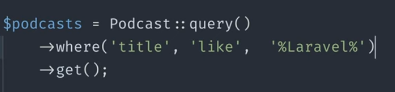
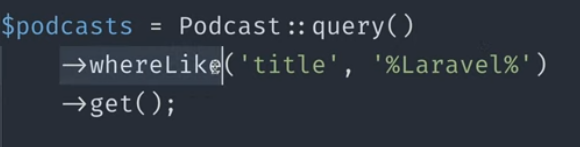
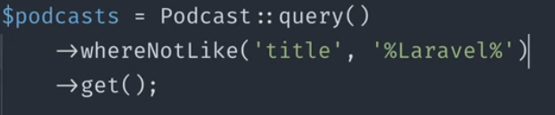
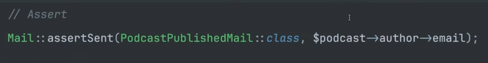
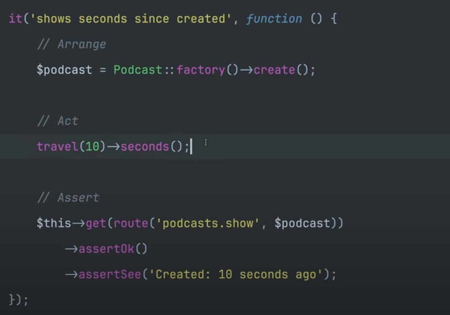
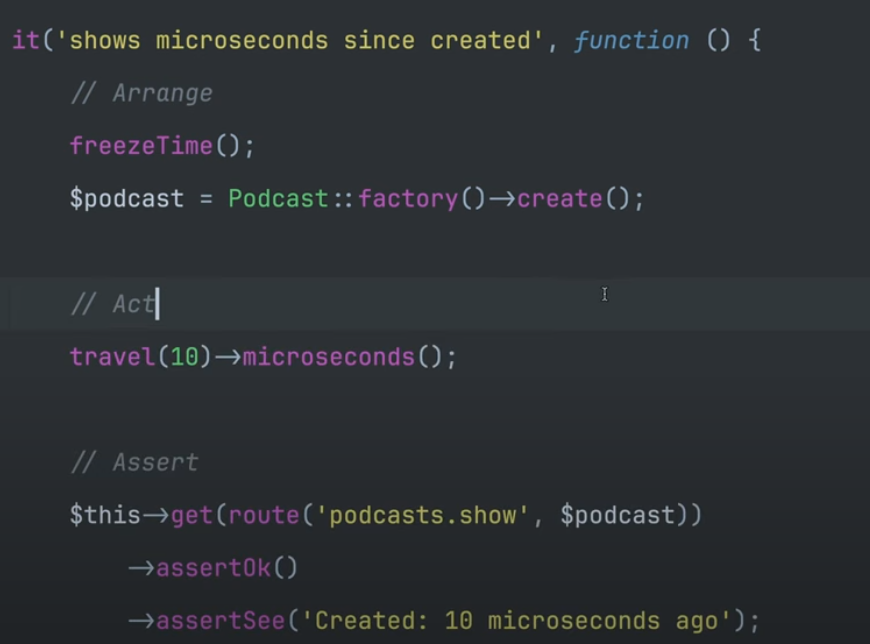

# Eloquent

In Laravel, **Eloquent** is a simple and expressive way to interact with your database using PHP. It provides an
active record implementation for working with your data, allowing you to define relationships between models
(e.g., one-to-one, many-to-many) and perform complex queries without writing raw SQL.

Think of Eloquent as a "superpower" for your database interactions!

Here are some key benefits:

* **Easy-to-use syntax**: Define relationships and query your data using simple PHP methods.
* **Active record implementation**: Create, read, update, and delete (CRUD) operations become easy with Eloquent.
* **Complex queries**: Perform joins, aggregations, and other advanced database operations without writing SQL.

In essence, Eloquent is a powerful tool for building robust and scalable applications using Laravel.

||
👇

- Mail Assent send can now using second argument as the sender email instead of closure

- Microsecond Travel

